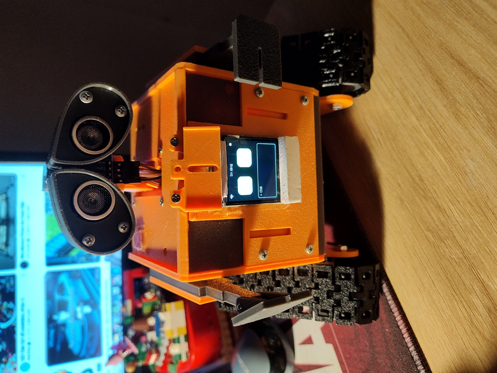
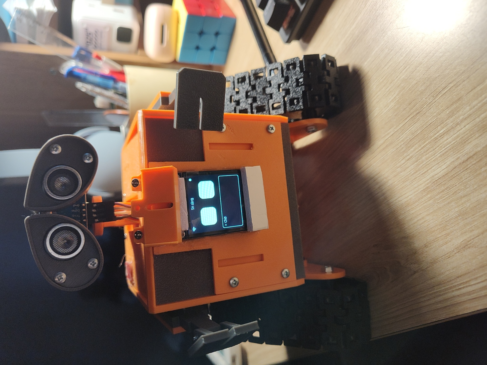
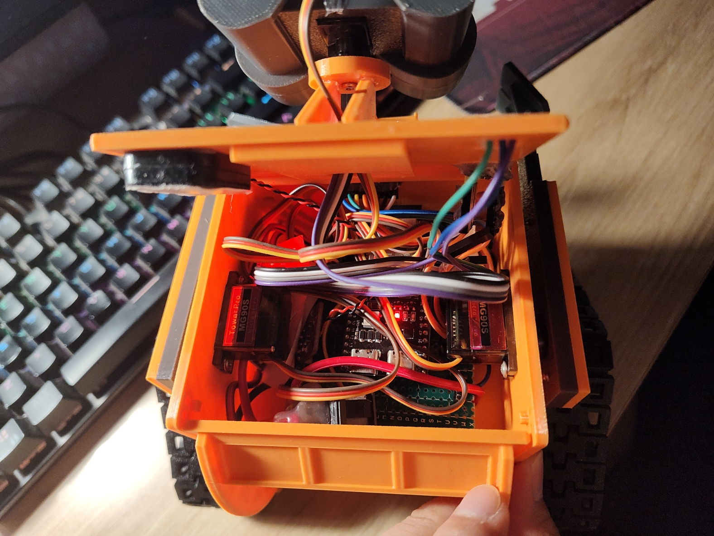

# Droid E3D XiaoZhi — Robot AI tương tác bằng giọng nói

<p align="center">
  
</p>

## Giới thiệu sản phẩm

**Droid E3D XiaoZhi** là robot tự lắp ráp có thiết kế lấy cảm hứng từ Wall-E,
kết hợp trò chuyện bằng giọng nói, màn hình biểu cảm và chuyển động trong một thiết bị.
Thân robot màu cam, hai bánh xích, đầu xoay và hai cánh tay tạo nên dáng vẻ gần gũi;
màn hình ở mặt trước hiển thị đôi mắt động cùng trạng thái nghe, suy nghĩ và trả lời.

Robot sử dụng **ESP32-S3 N16R8**, chạy firmware XiaoZhi với giao diện tiếng Việt.
Khi kết nối Wi-Fi và dịch vụ AI tương thích, bạn có thể trò chuyện, đặt câu hỏi và
đề nghị robot thực hiện các động tác như chào, vẫy tay hoặc di chuyển.
Việc hiểu lời nói và chọn hành động do dịch vụ AI đảm nhiệm; robot thực thi các
lệnh điều khiển được hỗ trợ thông qua MCP.

Droid E3D phù hợp để khám phá robot tương tác, học lập trình nhúng và thử nghiệm
cách kết hợp AI với phần cứng. Bạn có thể điều khiển bằng giọng nói, chạm cảm biến
trên robot hoặc mở giao diện web trên điện thoại để lái xe, chọn động tác và
hiệu chỉnh servo.

### Tính năng nổi bật

- **Trò chuyện bằng giọng nói:** mic INMP441 thu âm, mạch MAX98357A phát âm thanh;
  cấu hình hiện tại dùng âm thanh 16 kHz và mic gain 9.
- **Đánh thức bằng “Hi Wall-E”:** sử dụng mô hình WakeNet đi kèm để nhận câu đánh thức
  trên thiết bị trước khi bắt đầu hội thoại.
- **Đôi mắt có cảm xúc:** màn hình ST7789 240 × 240 hiển thị vui, buồn, tức giận,
  bất ngờ, sợ hãi, buồn ngủ, tinh nghịch và yêu thích. Khi chờ, mắt tự thay đổi
  kiểu mỗi 4 giây, kết hợp chớp mắt và chuyển động nhìn.
- **Chuyển động linh hoạt:** điều khiển độc lập hai bánh xích, đầu và hai tay;
  có các động tác dựng sẵn cùng chuỗi chuyển động tùy chỉnh, hỗ trợ lặp động tác.
- **Điều khiển từ điện thoại:** giao diện web có nút lái, chọn động tác,
  điều chỉnh servo, hiệu chỉnh bánh xích và nút dừng khẩn cấp.
- **Tương tác bằng chạm:** chạm một lần để bắt đầu/ngắt hội thoại, chạm hai lần
  để dừng chuyển động, chạm ba lần để đưa đầu và tay về tư thế đã lưu.
- **Kết nối và cấu hình:** hỗ trợ thiết lập Wi-Fi qua điểm truy cập của robot;
  khi đã kết nối mạng, điểm truy cập điều khiển cục bộ có thể hoạt động song song.

### Hình ảnh thực tế

Ảnh chụp robot đã lắp ráp, màn hình đang hiển thị trạng thái chờ:

<p align="center">
  
</p>

Bố trí linh kiện, dây nối và servo bên trong thân robot:

<p align="center">
  
</p>

Các ảnh thể hiện mẫu robot thực tế. Cụm cảm biến siêu âm trên đầu chưa được
firmware hiện tại sử dụng để tránh vật cản; chi tiết phần cứng và khả năng điều khiển
được mô tả trong tài liệu kỹ thuật bên dưới.

## Tài liệu kỹ thuật

This board integrates the Droid E3D hardware with XiaoZhi on an ESP32-S3 N16R8. It keeps audio,
display, touch, five servo outputs, web control, and MCP voice control in one firmware.

## Build

Use ESP-IDF 6.1 when available.

```sh
python3 scripts/build.py custom-s3-voice --name custom-s3-voice \
  --language vi-VN --wake-word wn9_hiwalle_tts2
```

The build options select Vietnamese UI strings, AFE wake-word processing, and the bundled
`wn9_hiwalle_tts2` model. The model's spoken phrase is **Hi Wall-E**. Showing the phrase as
**Hey Wall-E** does not change the acoustic model; exact recognition of "Hey" requires a separately
trained WakeNet model.

## Final pin map

| Function | GPIO |
|---|---:|
| Left continuous track | 4 |
| Right continuous track | 5 |
| Head servo | 6 |
| Left arm servo | 7 |
| Right arm servo | 15 |
| MAX98357A WS or LRC | 11 |
| MAX98357A BCLK | 12 |
| MAX98357A DIN | 13 |
| INMP441 SCK | 16 |
| INMP441 WS | 17 |
| INMP441 SD | 18 |
| TTP223 OUT | 21 |
| ST7789 SCK | 38 |
| ST7789 MOSI | 39 |
| ST7789 RST | 40 |
| ST7789 DC | 41 |
| ST7789 CS | 42 |

The ST7789 is 240 by 240 pixels, not 320 by 240. Default rotation 2 follows the supplied document;
the mounting orientation still requires visual confirmation. The web settings offer rotations
0–3, persisted in `droid-display/rotation` and applied after reboot. The driver is the sole owner
of the panel gap; LVGL receives zero offset. Rotation mapping follows the
[Adafruit ST7789 driver](https://github.com/adafruit/Adafruit-ST7735-Library/blob/master/Adafruit_ST7789.cpp):
0 = mirror X/Y, Y gap 80; 1 = swap X/Y + mirror Y, X gap 80; 2 = no mirrors/swap/gap;
3 = swap X/Y + mirror X, no gap. Backlight remains wired directly to 3.3 V.

Audio framing follows XIAOzITEST: mic I2S0, 16 kHz, 32-bit stereo, left sample shifted by 16,
and clamp ±30000; speaker I2S1, 16 kHz, 16-bit stereo with duplicated mono. Mic gain defaults
to 9, as requested on 2026-10-02 (the reference sketch used 8). A physical trial at gain 12 showed substantial clipping
while the speaker was playing, so it was reverted. Playback uses the saved XiaoZhi volume
with linear amplitude scaling: 70% retains 70% amplitude, compared with the previous 49%.
Received audio is resampled when necessary. Continuous capture has 96 ms of DMA storage and
playback has 120 ms, to tolerate short scheduling delays while Wi-Fi, AFE and the display run.
TX DMA is filled with silence before restarting to avoid replaying an old audio tail.

Every five seconds of capture, `DroidAudio` logs the amplified mic peak, RMS, clipped sample
count and RX queue overruns. Test at the normal speaking distance with the tracks stopped,
then while moving. Persistent clipping calls for reducing `AUDIO_MIC_GAIN_DEFAULT`; overruns
indicate lost capture buffers. Compare local record/play using the single-tap audio test in
Wi-Fi configuration mode with online speech recognition. Capture, wake/VAD, playback,
interruption and reconnect still require physical testing; a build cannot confirm sound quality.

## Touch controls

- Single tap toggles the conversation: tap once to wake/start talking and tap again to interrupt.
- Hold for 5 seconds to enter XiaoZhi Wi-Fi configuration mode.
- Double tap to stop both tracks and cancel the active gesture.
- Triple tap to move the head and arms to their saved home pose.

## Web pages

After the board joins its saved Internet Wi-Fi, it also starts the open `DroidE3D-Control` access
point. Connect a phone to that AP and open `http://192.168.4.1:8080/control` for driving, gestures,
servo and track calibration, and emergency stop. The Internet station and local AP
run together. Open `http://192.168.4.1:8080/wifi` for network status and provisioning.

When provisioning is requested, the control AP is temporarily stopped so XiaoZhi's standard captive
portal can own the AP interface on port 80. Connect to `Xiaozhi-*` and open
`http://192.168.4.1`. `DroidE3D-Control` returns automatically after the new Internet connection is
established.

## Safety and calibration

The track outputs always have a deadline. Browser drive commands refresh a 700 ms deadline, short
track tests run for 250 ms, and MCP track commands must include a duration from 100 to 5000 ms.
STOP cancels gestures and neutralizes both tracks. Joint and track status values are commanded
values because the current hardware has no encoder or position feedback.

The gesture scheduler commands at most four moving outputs at once. If both tracks and all three
joints need to move, it runs the arms first and resumes the head 120 ms after both tracks stop,
matching TEST_5. This caps changing commands, not holding current or measured physical motion.

Default calibration is left neutral 1505 microseconds, right neutral 1500 microseconds, and
90 degrees for the head and both arms. The physical test reported the mapping
forward→right, backward→left, left→backward and right→forward with track signs -1/-1.
Flipping only the right track gives effective signs -1/+1 and the requested semantic axes.
Firmware r4 makes -1/+1 the defaults and migrates the older `leftFlip`/`rightFlip` NVS flags
through `polarityV2`, preserving the effective signs already stored by r3. The reset-calibration
command now restores -1/+1. User confirmation of physical motion after the update is still needed.
Per-track flip controls
remain available. Calibration uses the existing `droid-tracks` NVS namespace so neutral and home
values written by the Arduino test firmware can be retained when the partition is preserved.

Power the servos from a supply sized for their stall current and join its ground to ESP32 ground.
Do not feed 5 V into a GPIO or the 3.3 V rail. HC-SR04 support is intentionally omitted until TRIG,
ECHO, and a 5 V to 3.3 V ECHO divider are physically confirmed.

The control page preserves the original TEST_5 CSS and SVG symbols. Its HTTP command adapter
serializes requests, coalesces slider/drive updates and drops queued movement on STOP. Wi-Fi stays
on its own page. Eye activity (idle/listening/thinking/speaking) owns animation and color; emotion
adds happy, sad, angry, surprised, confused or sleepy shapes without overwriting activity.

Reference checks: `python -m unittest scripts.tests.test_droid_reference -v`.

## Custom motion commands (r3)

The board exposes `self.robot.run_sequence`, `self.robot.wave_arms`,
`self.robot.drive_tracks` and `self.robot.spin_turns` to the XiaoZhi backend.
`run_gesture` also accepts `repeat`.
Speech interpretation/tool selection is done by the connected backend; firmware cannot promise
to understand every phrase or perform actions beyond the installed hardware. It reports command
acceptance separately from completion. `self.robot.state` includes program status, current frame,
completed cycles and spin calibration. A new custom program is rejected while another motion is
in progress; use STOP for deliberate replacement.

Examples to ask: “Vẫy hai tay 5 lần”, “Vẫy tay trái 3 lần”, “Tiến nửa giây rồi chào”,
“Đưa hai tay lên, giữ một giây rồi về chuẩn”. Use one sequence call for compound requests.
The original 12 gesture trajectories and UI palette remain intact.

`wave_arms` accepts `arms=left/right/both` and `pattern=mirror/parallel/alternate`.
On the user's assembled robot, `mirror` now commands the same signed servo offsets for
physically opposite arm travel; `parallel` commands opposite signed offsets for physically
same-direction travel; `alternate` commands left then right. This mapping follows the user's
physical observation and still needs a low-amplitude verification after flashing. The web calibration dialog
exposes all three patterns and separate left/right wave buttons. Both track sliders remain
independent; four short 250 ms test buttons provide explicit left/right forward/backward checks.
For spoken independent track commands, `drive_tracks` accepts signed physical forward speeds
`left_pct`/`right_pct` in -60..60 and `duration_ms` in 100..5000, then stops automatically.
Compound programs can use `{"tracks":{"left":35,"right":-35},"duration_ms":500}`
as a step instead of `drive`; omitted track side is zero. It cannot be mixed with `drive`
in the same step.
The track outputs are continuous-rotation servos, not angle-controlled legs. No encoder/IMU
position feedback is available. The four-moving-output scheduler remains active.

The web control page also has a XiaoZhi talk/interrupt button, equivalent to one touch tap.
The eyes cycle through subtle lime-green idle expressions and show a distinct motion animation
while tracks, arms or head are moving; listening/thinking/speaking still take precedence.
The head PWM electrical span defaults to the tested 1000–2000 µs at commanded 0–180°.
The web setting can widen it symmetrically, in 25 µs increments, up to 800–2200 µs.
Saving requires the head at 90° and the robot stopped. Users must increase it gradually and
stop if the physical mechanism binds; this setting does not measure physical angle.

`run_sequence.program` is a JSON **string**, with optional `repeat` (default 1) and `steps`:

```json
{
  "repeat": 3,
  "steps": [
    {"pose": {"leftArm": -35, "rightArm": 35}, "relative": true, "hold_ms": 180},
    {"pose": {"leftArm": 0, "rightArm": 0}, "relative": true, "hold_ms": 180}
  ]
}
```

Each step is either `{"gesture":"greet"}` or a combination of:

- `pose`: optional head/leftArm/rightArm integer angles 0–180. Omitted joints stay unchanged.
- `relative:true`: pose offsets -60..60 relative to saved home, with final angles clamped 0–180.
- `joint_speed`: 10–100 deg/s (quantized to the control tick).
- `drive`: forward/backward/left/right; requires duration_ms 100–5000, optional speed 10–60%.
- `hold_ms`: 0–5000, waited after the frame's commanded movement finishes.

Limits: 4096-byte program, 32 steps, 64 expanded frames, repeat 1–20; conservative worst-case
duration and a runtime deadline both cap programs at 120 seconds. No executable scripts or infinite
loops. Validation occurs before any motion; `dry_run:true` only validates. Head scheduling and the
four-commanded-moving-output cap apply to custom and original gestures. STOP/double-tap cancels
the whole sequence. Web programs additionally require heartbeat and stop if the page disconnects.

“Xoay 10 vòng” is **time-estimated**, not measured. The user must measure one turn in each direction
at 40% speed and save 1000–10000 ms values under web settings. Defaults are zero, so uncalibrated
spin requests are rejected. Durations above 5 seconds use two bounded track bursts; calibrate using
that same motion pattern. Each estimated turn ends with a 250 ms hold. Surface, battery and load
affect accuracy. There is no obstacle detection: provide clear space and keep STOP accessible.
Changing track neutral or polarity invalidates both spin calibrations. Spin calibration is not
exposed to the language model as a writable tool, to prevent invented measurements.

Host executable tests (MinGW UCRT64 on Windows): `./scripts/tests/run_droid_motion_tests.ps1`.
These compile the actual parser, frame advancement and joint scheduler. They verify synchronized
arms, four-output scheduling, deferred head, repeats, budgets and malformed/range-invalid input.
They do not validate servo travel, spoken recognition, or measured revolutions on physical hardware.

Track polarity correction on 2026-09-29: COM11 flashed with r4, flash hash verified.
After boot the HTTP status reported PWM ready, idle gesture, both tracks stopped, and effective
signs left -1/right +1. The live smoke test passed again on r4 without actuating motors.
The user still needs to confirm the four physical directions at low speed.

Validation on 2026-09-29: ESP-IDF 6.1 build and COM11 flash succeeded (flash hash verified,
34% app partition free). `droid_motion_smoke.ps1` passed against the live r3 firmware: valid
motion dry-run without starting movement, invalid input and uncalibrated spin rejection,
wait-only program with three repeats, busy rejection, STOP cancellation and web heartbeat timeout.
Track signs remained -1/-1, display rotation 2, mic gain 8, audio 16 kHz, saved output volume 70.
No physical drive or arm movement was requested by these smoke tests. End-to-end spoken commands
and physical motion/turn calibration still require the user at the robot.

2026-09-30 motion/face update: COM11 ESP32-S3 app flashed at 115200 baud to OTA0, write hash
verified; NVS, assets and Wi-Fi credentials were not erased. An earlier 460800-baud attempt
disconnected before completion, so it was superseded by this verified flash. Host motion/eye
tests, reference-preservation tests, UI JavaScript syntax, C++ formatting, and the ESP-IDF 6.1
board build passed (34% app partition free). Physical arm direction, head clearance, eye
appearance and spoken MCP behavior still need on-device checks.

## Reference eye expressions

Standby cycles every four seconds through neutral, curious, happy (yellow arches),
mischievous (lime wink), surprised (purple), loving (pink with blush), sad (cyan),
scared (orange), angry (red angled lids), and sleepy (green). Blinking and gaze motion
continue. Returning from a conversation to standby starts the cycle again.
Server emotions select these shapes during speech; listening, thinking and motion retain
activity priority. `loving`, `scared`/`fearful`/`afraid`, and
`silly`/`winking`/`mischievous` are supported alongside the existing emotion names.
The eyes use LVGL geometry and bounded curved strokes rather than bitmap assets.
Physical ST7789 appearance and animation smoothness require on-device verification.
